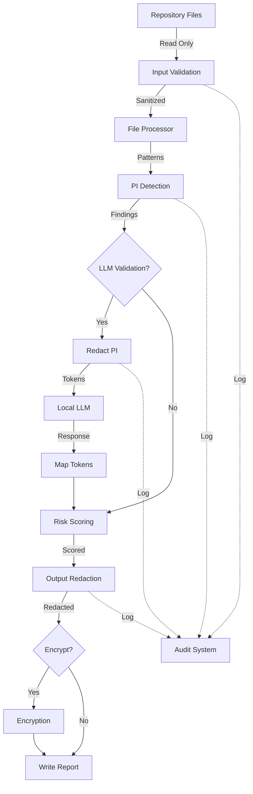

# PI Scanner Security Design Document

## Overview

This document details the security architecture and controls for the PI Scanner, ensuring that the tool designed to protect PI doesn't become a vector for exposure.

## Security Principles

### 1. Defense in Depth
Multiple layers of security controls to prevent PI exposure:
- **Layer 1**: Input validation and sanitization
- **Layer 2**: Local-only processing by default
- **Layer 3**: Mandatory redaction in outputs
- **Layer 4**: Encryption for data at rest
- **Layer 5**: Comprehensive audit logging

### 2. Principle of Least Privilege
- Scanner runs with minimal permissions
- No elevated access required
- Read-only repository access
- Temporary files in restricted directories

### 3. Secure by Default
- Full redaction enabled by default
- External endpoints blocked by default
- Encryption recommended for outputs
- Audit logging always active

## Threat Model

### Identified Threats

#### T1: PI Exposure via External Services
**Threat**: PI data sent to external LLM or logging services
**Impact**: Critical - Direct PI exposure
**Mitigations**:
- Endpoint validation restricts to localhost
- Network policy enforcement
- Audit logging of all external calls

#### T2: PI Leakage in Output Files
**Threat**: Unredacted PI in reports accessible to unauthorized users
**Impact**: High - PI disclosure through reports
**Mitigations**:
- Mandatory redaction by default
- Encryption options for sensitive reports
- Access control recommendations

#### T3: Memory Disclosure Attacks
**Threat**: PI extracted from process memory
**Impact**: Medium - Requires local access
**Mitigations**:
- Minimal PI retention in memory
- Secure string handling
- Memory clearing after use

#### T4: Log File Exposure
**Threat**: PI accidentally logged during scanning
**Impact**: High - Persistent PI storage
**Mitigations**:
- Structured logging with PI filtering
- Log redaction middleware
- Secure log storage

#### T5: Temporary File Disclosure
**Threat**: PI left in temporary files after scanning
**Impact**: Medium - Requires file system access
**Mitigations**:
- Secure temporary directory creation
- Automatic cleanup on exit
- File permissions restrictions

## Security Architecture

### Component Security Model

```
┌─────────────────────────────────────────────────────────────┐
│                    Security Perimeter                        │
│                                                              │
│  ┌─────────────┐     ┌──────────────┐    ┌──────────────┐ │
│  │   Input     │     │  Processing  │    │   Output     │ │
│  │ Validation  │────▶│   Engine     │───▶│  Redaction   │ │
│  └─────────────┘     └──────────────┘    └──────────────┘ │
│         │                    │                     │        │
│         ▼                    ▼                     ▼        │
│  ┌─────────────┐     ┌──────────────┐    ┌──────────────┐ │
│  │   Audit     │     │   Memory     │    │ Encryption   │ │
│  │   Logger    │     │  Management  │    │   Engine     │ │
│  └─────────────┘     └──────────────┘    └──────────────┘ │
│                                                              │
│  ┌────────────────────────────────────────────────────────┐ │
│  │              Local LLM Interface                        │ │
│  │  ┌──────────┐  ┌──────────┐  ┌──────────────────────┐ │ │
│  │  │ Endpoint │  │    PI    │  │   Request/Response   │ │ │
│  │  │Validator │  │ Redactor │  │      Logging         │ │ │
│  │  └──────────┘  └──────────┘  └──────────────────────┘ │ │
│  └────────────────────────────────────────────────────────┘ │
└─────────────────────────────────────────────────────────────┘
```

### Data Flow Security



## Implementation Details

### 1. Input Validation Layer

```go
// pkg/security/input_validator.go
package security

import (
    "fmt"
    "net/url"
    "path/filepath"
    "strings"
)

type InputValidator struct {
    maxPathLength   int
    allowedSchemes  []string
    blockedPatterns []string
    auditLogger     AuditLogger
}

func (v *InputValidator) ValidateRepositoryURL(rawURL string) error {
    // Parse URL
    u, err := url.Parse(rawURL)
    if err != nil {
        return fmt.Errorf("invalid URL format: %w", err)
    }

    // Check scheme
    if !v.isAllowedScheme(u.Scheme) {
        v.auditLogger.SecurityEvent("blocked_url_scheme", map[string]string{
            "url":    rawURL,
            "scheme": u.Scheme,
        })
        return fmt.Errorf("scheme %s not allowed", u.Scheme)
    }

    // Check for injection attempts
    if v.containsBlockedPattern(rawURL) {
        v.auditLogger.SecurityEvent("blocked_url_pattern", map[string]string{
            "url": rawURL,
        })
        return fmt.Errorf("URL contains blocked pattern")
    }

    return nil
}

func (v *InputValidator) ValidateFilePath(path string) error {
    // Clean and validate path
    cleanPath := filepath.Clean(path)

    // Check length
    if len(cleanPath) > v.maxPathLength {
        return fmt.Errorf("path too long: %d > %d", len(cleanPath), v.maxPathLength)
    }

    // Prevent directory traversal
    if strings.Contains(cleanPath, "..") {
        v.auditLogger.SecurityEvent("path_traversal_attempt", map[string]string{
            "path": path,
        })
        return fmt.Errorf("path traversal detected")
    }

    // Check against blocked patterns
    if v.containsBlockedPattern(cleanPath) {
        return fmt.Errorf("path contains blocked pattern")
    }

    return nil
}
```

### 2. Secure Memory Management

```go
// pkg/security/secure_memory.go
package security

import (
    "crypto/rand"
    "runtime"
    "sync"
    "unsafe"
)

// SecureString provides a string that can be securely wiped from memory
type SecureString struct {
    data []byte
    mu   sync.Mutex
}

func NewSecureString(s string) *SecureString {
    ss := &SecureString{
        data: []byte(s),
    }
    runtime.SetFinalizer(ss, (*SecureString).Destroy)
    return ss
}

func (s *SecureString) String() string {
    s.mu.Lock()
    defer s.mu.Unlock()
    return string(s.data)
}

func (s *SecureString) Destroy() {
    s.mu.Lock()
    defer s.mu.Unlock()

    // Overwrite with random data
    rand.Read(s.data)

    // Clear the slice
    for i := range s.data {
        s.data[i] = 0
    }

    // Force garbage collection
    s.data = nil
    runtime.GC()
}

// SecureBuffer provides a reusable buffer with secure cleanup
type SecureBuffer struct {
    buf  []byte
    size int
    pool *sync.Pool
}

func NewSecureBufferPool(size int) *sync.Pool {
    return &sync.Pool{
        New: func() interface{} {
            return &SecureBuffer{
                buf:  make([]byte, size),
                size: size,
            }
        },
    }
}

func (b *SecureBuffer) Reset() {
    // Securely clear buffer
    for i := range b.buf {
        b.buf[i] = 0
    }
}

func (b *SecureBuffer) Bytes() []byte {
    return b.buf
}
```

### 3. Audit Logging System

```go
// pkg/security/audit_logger.go
package security

import (
    "crypto/hmac"
    "crypto/sha256"
    "encoding/json"
    "fmt"
    "sync"
    "time"
)

type AuditLogger struct {
    writer      AuditWriter
    hmacKey     []byte
    redactor    PIRedactor
    mu          sync.Mutex
    sequenceNum uint64
}

type AuditEvent struct {
    Timestamp   time.Time              `json:"timestamp"`
    EventType   string                 `json:"event_type"`
    UserID      string                 `json:"user_id"`
    SessionID   string                 `json:"session_id"`
    Details     map[string]interface{} `json:"details"`
    Sequence    uint64                 `json:"sequence"`
    Signature   string                 `json:"signature"`
}

func (l *AuditLogger) LogSecurityEvent(eventType string, details map[string]interface{}) error {
    l.mu.Lock()
    defer l.mu.Unlock()

    // Increment sequence number
    l.sequenceNum++

    // Create event
    event := AuditEvent{
        Timestamp: time.Now().UTC(),
        EventType: eventType,
        UserID:    getCurrentUser(),
        SessionID: getSessionID(),
        Details:   l.redactDetails(details),
        Sequence:  l.sequenceNum,
    }

    // Sign event
    event.Signature = l.signEvent(event)

    // Write event
    return l.writer.Write(event)
}

func (l *AuditLogger) redactDetails(details map[string]interface{}) map[string]interface{} {
    redacted := make(map[string]interface{})

    for k, v := range details {
        switch val := v.(type) {
        case string:
            if l.redactor.IsPossiblePI(val) {
                redacted[k] = l.redactor.Redact(val)
            } else {
                redacted[k] = val
            }
        default:
            redacted[k] = val
        }
    }

    return redacted
}

func (l *AuditLogger) signEvent(event AuditEvent) string {
    // Create deterministic JSON
    data, _ := json.Marshal(struct {
        Timestamp time.Time              `json:"timestamp"`
        EventType string                 `json:"event_type"`
        UserID    string                 `json:"user_id"`
        SessionID string                 `json:"session_id"`
        Details   map[string]interface{} `json:"details"`
        Sequence  uint64                 `json:"sequence"`
    }{
        Timestamp: event.Timestamp,
        EventType: event.EventType,
        UserID:    event.UserID,
        SessionID: event.SessionID,
        Details:   event.Details,
        Sequence:  event.Sequence,
    })

    // Generate HMAC
    h := hmac.New(sha256.New, l.hmacKey)
    h.Write(data)
    return fmt.Sprintf("%x", h.Sum(nil))
}

// Critical security events that must always be logged
func (l *AuditLogger) LogPIAccess(piType, operation string, redacted bool) {
    l.LogSecurityEvent("pi_access", map[string]interface{}{
        "pi_type":   piType,
        "operation": operation,
        "redacted":  redacted,
        "stack":     getCallStack(),
    })
}

func (l *AuditLogger) LogEndpointValidation(endpoint string, allowed bool) {
    l.LogSecurityEvent("endpoint_validation", map[string]interface{}{
        "endpoint": sanitizeURL(endpoint),
        "allowed":  allowed,
    })
}

func (l *AuditLogger) LogRedactionBypass(reason string) {
    l.LogSecurityEvent("redaction_bypass", map[string]interface{}{
        "reason":     reason,
        "authorized": false,
        "alert":      true,
    })
}
```

### 4. Encryption Framework

```go
// pkg/security/encryption.go
package security

import (
    "crypto/aes"
    "crypto/cipher"
    "crypto/rand"
    "crypto/sha256"
    "encoding/base64"
    "fmt"
    "io"

    "golang.org/x/crypto/argon2"
)

type Encryptor struct {
    keyDerivation KeyDerivation
    auditLogger   AuditLogger
}

type KeyDerivation struct {
    Time    uint32
    Memory  uint32
    Threads uint8
    KeyLen  uint32
    SaltLen uint32
}

// DeriveKey derives an encryption key from a passphrase
func (e *Encryptor) DeriveKey(passphrase string) ([]byte, []byte, error) {
    // Generate salt
    salt := make([]byte, e.keyDerivation.SaltLen)
    if _, err := rand.Read(salt); err != nil {
        return nil, nil, fmt.Errorf("generate salt: %w", err)
    }

    // Derive key using Argon2
    key := argon2.IDKey(
        []byte(passphrase),
        salt,
        e.keyDerivation.Time,
        e.keyDerivation.Memory,
        e.keyDerivation.Threads,
        e.keyDerivation.KeyLen,
    )

    e.auditLogger.LogSecurityEvent("key_derived", map[string]interface{}{
        "algorithm": "argon2id",
        "key_len":   e.keyDerivation.KeyLen,
    })

    return key, salt, nil
}

// EncryptData encrypts data using AES-256-GCM
func (e *Encryptor) EncryptData(data []byte, key []byte) ([]byte, error) {
    // Create cipher
    block, err := aes.NewCipher(key)
    if err != nil {
        return nil, fmt.Errorf("create cipher: %w", err)
    }

    // Create GCM
    gcm, err := cipher.NewGCM(block)
    if err != nil {
        return nil, fmt.Errorf("create GCM: %w", err)
    }

    // Create nonce
    nonce := make([]byte, gcm.NonceSize())
    if _, err := io.ReadFull(rand.Reader, nonce); err != nil {
        return nil, fmt.Errorf("generate nonce: %w", err)
    }

    // Encrypt data
    ciphertext := gcm.Seal(nonce, nonce, data, nil)

    e.auditLogger.LogSecurityEvent("data_encrypted", map[string]interface{}{
        "algorithm":   "AES-256-GCM",
        "data_size":   len(data),
        "cipher_size": len(ciphertext),
    })

    return ciphertext, nil
}

// EncryptedOutput provides encrypted report writing
type EncryptedOutput struct {
    encryptor   *Encryptor
    writer      io.Writer
    key         []byte
    metadata    EncryptionMetadata
}

type EncryptionMetadata struct {
    Algorithm   string `json:"algorithm"`
    KeyDerivation string `json:"key_derivation"`
    Salt        string `json:"salt"`
    Nonce       string `json:"nonce"`
    Version     int    `json:"version"`
}

func (o *EncryptedOutput) Write(data []byte) error {
    // Encrypt data
    encrypted, err := o.encryptor.EncryptData(data, o.key)
    if err != nil {
        return fmt.Errorf("encrypt output: %w", err)
    }

    // Write metadata header
    header, err := json.Marshal(o.metadata)
    if err != nil {
        return fmt.Errorf("marshal metadata: %w", err)
    }

    // Write encrypted file format
    // [4 bytes: header length][header][encrypted data]
    if err := binary.Write(o.writer, binary.LittleEndian, uint32(len(header))); err != nil {
        return err
    }

    if _, err := o.writer.Write(header); err != nil {
        return err
    }

    if _, err := o.writer.Write(encrypted); err != nil {
        return err
    }

    return nil
}
```

### 5. Network Security Controls

```go
// pkg/security/network_policy.go
package security

import (
    "context"
    "fmt"
    "net"
    "net/http"
    "time"
)

type NetworkPolicy struct {
    allowedHosts    []string
    allowedNetworks []*net.IPNet
    denyList        []string
    resolver        *net.Resolver
    auditLogger     AuditLogger
}

// SecureHTTPClient creates an HTTP client with security controls
func (p *NetworkPolicy) SecureHTTPClient() *http.Client {
    return &http.Client{
        Timeout: 30 * time.Second,
        Transport: &secureTransport{
            policy: p,
            base:   http.DefaultTransport,
        },
        CheckRedirect: func(req *http.Request, via []*http.Request) error {
            if len(via) >= 3 {
                return fmt.Errorf("too many redirects")
            }

            // Validate redirect destination
            if err := p.ValidateHost(req.URL.Host); err != nil {
                return fmt.Errorf("redirect blocked: %w", err)
            }

            return nil
        },
    }
}

type secureTransport struct {
    policy *NetworkPolicy
    base   http.RoundTripper
}

func (t *secureTransport) RoundTrip(req *http.Request) (*http.Response, error) {
    // Validate destination
    if err := t.policy.ValidateHost(req.URL.Host); err != nil {
        t.policy.auditLogger.LogSecurityEvent("blocked_request", map[string]interface{}{
            "host":   req.URL.Host,
            "method": req.Method,
            "reason": err.Error(),
        })
        return nil, err
    }

    // Add security headers
    req.Header.Set("User-Agent", "PI-Scanner/1.0")
    req.Header.Set("X-Scanner-Version", "1.0")

    // Log request
    t.policy.auditLogger.LogSecurityEvent("outbound_request", map[string]interface{}{
        "host":   req.URL.Host,
        "method": req.Method,
        "path":   req.URL.Path,
    })

    return t.base.RoundTrip(req)
}

func (p *NetworkPolicy) ValidateHost(host string) error {
    // Extract hostname and port
    hostname, _, err := net.SplitHostPort(host)
    if err != nil {
        hostname = host
    }

    // Check deny list
    for _, denied := range p.denyList {
        if hostname == denied {
            return fmt.Errorf("host is denied: %s", hostname)
        }
    }

    // Check allowed hosts
    for _, allowed := range p.allowedHosts {
        if hostname == allowed {
            return nil
        }
    }

    // Resolve IP
    ctx, cancel := context.WithTimeout(context.Background(), 5*time.Second)
    defer cancel()

    ips, err := p.resolver.LookupHost(ctx, hostname)
    if err != nil {
        return fmt.Errorf("resolve host: %w", err)
    }

    // Check if IP is in allowed networks
    for _, ipStr := range ips {
        ip := net.ParseIP(ipStr)
        for _, network := range p.allowedNetworks {
            if network.Contains(ip) {
                return nil
            }
        }
    }

    return fmt.Errorf("host not in allowed networks: %s", hostname)
}
```

## Security Configuration

### Default Security Configuration

```yaml
# config/security.yaml
security:
  # Input validation
  input_validation:
    max_path_length: 4096
    allowed_url_schemes:
      - https
      - ssh
    blocked_patterns:
      - "../../"
      - "%2e%2e"
      - "\\x00"

  # Network policy
  network_policy:
    allowed_hosts:
      - localhost
      - 127.0.0.1
      - ::1
    allowed_networks:
      - "10.0.0.0/8"
      - "172.16.0.0/12"
      - "192.168.0.0/16"
      - "fc00::/7"
    deny_list:
      - "metadata.google.internal"
      - "169.254.169.254"

  # LLM security
  llm_security:
    allow_external: false
    require_https_for_external: true
    redaction_mode: "full"
    endpoint_allowlist:
      - "http://localhost:*"
      - "http://127.0.0.1:*"

  # Output security
  output_security:
    default_redaction_level: "full"
    enforce_minimum_redaction: true
    require_encryption_for_critical: true
    allowed_export_formats:
      - json
      - csv
      - sarif

  # Audit logging
  audit_logging:
    enabled: true
    log_pi_access: true
    log_endpoint_validation: true
    log_redaction_events: true
    retention_days: 90

  # Encryption
  encryption:
    algorithm: "AES-256-GCM"
    key_derivation:
      algorithm: "argon2id"
      time: 3
      memory: 65536
      threads: 4
      key_length: 32
      salt_length: 32
```

### Security Headers for Web Interface

```go
// pkg/web/security_middleware.go
func SecurityHeaders() gin.HandlerFunc {
    return func(c *gin.Context) {
        // Security headers
        c.Header("X-Content-Type-Options", "nosniff")
        c.Header("X-Frame-Options", "DENY")
        c.Header("X-XSS-Protection", "1; mode=block")
        c.Header("Strict-Transport-Security", "max-age=31536000; includeSubDomains")
        c.Header("Content-Security-Policy", "default-src 'self'; script-src 'self' 'unsafe-inline'; style-src 'self' 'unsafe-inline'")
        c.Header("Referrer-Policy", "strict-origin-when-cross-origin")
        c.Header("Permissions-Policy", "geolocation=(), microphone=(), camera=()")

        c.Next()
    }
}
```

## Security Testing

### Security Test Suite

```go
// tests/security/security_test.go
func TestSecurity_PreventExternalEndpoints(t *testing.T) {
    tests := []struct {
        name        string
        endpoint    string
        shouldBlock bool
    }{
        {"localhost allowed", "http://localhost:1234", false},
        {"external blocked", "https://api.openai.com", true},
        {"private network needs flag", "http://192.168.1.100", true},
        {"suspicious pattern blocked", "http://localhost:1234/../../../etc/passwd", true},
    }

    for _, tt := range tests {
        t.Run(tt.name, func(t *testing.T) {
            policy := NewDefaultNetworkPolicy()
            err := policy.ValidateEndpoint(tt.endpoint)

            if tt.shouldBlock {
                assert.Error(t, err)
            } else {
                assert.NoError(t, err)
            }
        })
    }
}

func TestSecurity_AuditLogIntegrity(t *testing.T) {
    logger := NewAuditLogger(testKey)

    // Log event
    event := AuditEvent{
        EventType: "test_event",
        Details:   map[string]interface{}{"action": "test"},
    }

    logger.LogEvent(event)

    // Verify signature
    verified := logger.VerifyEvent(event)
    assert.True(t, verified)

    // Tamper with event
    event.Details["action"] = "modified"

    // Verification should fail
    verified = logger.VerifyEvent(event)
    assert.False(t, verified)
}
```

### Penetration Test Scenarios

```bash
#!/bin/bash
# security/pentest.sh

echo "Running PI Scanner Security Tests..."

# Test 1: Attempt to use external LLM
echo "Test 1: External LLM Block"
./pi-scanner scan --llm-endpoint "https://api.openai.com/v1" test-repo/ 2>&1 | grep -q "external endpoints not allowed" && echo "PASS" || echo "FAIL"

# Test 2: Path traversal attempt
echo "Test 2: Path Traversal"
./pi-scanner scan "../../../../../../etc/passwd" 2>&1 | grep -q "path traversal detected" && echo "PASS" || echo "FAIL"

# Test 3: Redaction bypass attempt
echo "Test 3: Redaction Bypass"
./pi-scanner scan --redaction-level none test-repo/ 2>&1 | grep -q "minimum redaction enforced" && echo "PASS" || echo "FAIL"

# Test 4: Memory dump attempt
echo "Test 4: Memory Protection"
PID=$(./pi-scanner scan test-repo/ & echo $!)
sleep 2
gcore -o dump $PID 2>/dev/null
if grep -q "123-456-789" dump.*; then
    echo "FAIL - PI found in memory dump"
else
    echo "PASS - PI not found in memory dump"
fi
rm -f dump.*

# Test 5: Network policy test
echo "Test 5: Network Policy"
# Start netcat listener on external IP
nc -l 8888 &
NC_PID=$!
./pi-scanner scan --llm-endpoint "http://$(hostname -I | awk '{print $1}'):8888" test-repo/ 2>&1 | grep -q "not in allowed networks" && echo "PASS" || echo "FAIL"
kill $NC_PID 2>/dev/null
```

## Security Checklist

### Pre-deployment Security Checklist

- [ ] All endpoints validate against allowlist
- [ ] Redaction is mandatory and enforced
- [ ] Audit logging is enabled and tested
- [ ] Encryption keys are properly managed
- [ ] Network policies are configured
- [ ] Security headers are set
- [ ] Input validation is comprehensive
- [ ] Memory is securely managed
- [ ] Temporary files are cleaned up
- [ ] Error messages don't leak information
- [ ] Dependencies are scanned for vulnerabilities
- [ ] Security tests pass
- [ ] Penetration testing completed
- [ ] Security documentation updated

### Incident Response Plan

1. **Detection**
   - Monitor audit logs for anomalies
   - Alert on security policy violations
   - Track failed authentication attempts

2. **Containment**
   - Disable affected features
   - Block suspicious endpoints
   - Increase logging verbosity

3. **Eradication**
   - Patch vulnerabilities
   - Update security controls
   - Rotate credentials

4. **Recovery**
   - Restore normal operations
   - Verify security controls
   - Update documentation

5. **Lessons Learned**
   - Document incident
   - Update security policies
   - Improve detection capabilities

## Compliance Considerations

### Privacy Compliance

- **Data Minimization**: Only process necessary data
- **Purpose Limitation**: Use data only for scanning
- **Storage Limitation**: Delete temporary data promptly
- **Integrity**: Protect data from tampering
- **Confidentiality**: Encrypt sensitive data

### Audit Requirements

- Log retention for 90 days minimum
- Tamper-evident logging
- Regular audit reviews
- Compliance reporting capabilities

## Conclusion

This security design ensures the PI Scanner:
1. **Protects PI** during scanning operations
2. **Prevents leakage** through multiple controls
3. **Maintains audit trail** for compliance
4. **Implements defense in depth** across all layers
5. **Follows security best practices** throughout

Regular security reviews and updates ensure continued protection as threats evolve.
